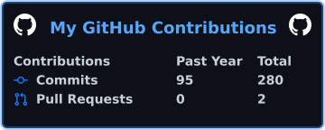

# 👋 Hi, I'm Aminul Islam Shamim

### 💻 Full-Stack Web Developer | JavaScript Enthusiast | 🔐 Web Security Learner

---

## 👨‍💻 About Me

I'm a passionate **full-stack web developer** who enjoys building modern, practical web applications.

I love working with **JavaScript, React, Node.js, Express, and MongoDB**, and I'm continuously improving my development skills by building real-world projects.

I'm also exploring **Web Security and Ethical Hacking** to understand how modern web applications work from both the development and security perspectives.

I believe that a good developer should not only know how to build applications, but also understand how to build them **securely**.

---

## 🛠️ Tech Stack

### 💻 Frontend

### ⚙️ Backend & Database

### 🔧 Tools

---

## 🔐 Web Security & Ethical Hacking

I'm currently learning **Web Application Security, Penetration Testing, and Bug Hunting** alongside full-stack development.

### 🛡️ Security Skills

- 🌐 Web Application Security
- 🔎 Web Penetration Testing
- 🧪 Vulnerability Assessment
- 🐞 Bug Bounty Methodology
- 🔐 Authentication & Authorization
- 💉 SQL Injection (SQLi)
- 🌐 Cross-Site Scripting (XSS)
- 🔗 Cross-Site Request Forgery (CSRF)
- 🛡️ Broken Access Control / IDOR
- 📤 File Upload Vulnerabilities
- ⚙️ Server-Side Request Forgery (SSRF)
- 💻 Command Injection
- 🔄 HTTP Request/Response Analysis
- 🍪 Cookies & Session Security
- 🔑 JWT Security
- 🧩 API Security
- 📡 Networking Fundamentals
- 🐧 Linux Fundamentals
- 📋 OWASP Top 10

### 🧰 Security Tools

### 🔬 Security Areas I'm Exploring

- Web Application Penetration Testing
- API Security Testing
- Reconnaissance & Enumeration
- Vulnerability Discovery
- Authentication & Session Testing
- Access Control Testing
- Security Misconfiguration
- Client-Side & Server-Side Vulnerabilities
- Bug Bounty Hunting
- Secure Coding Practices

> My goal is to become a developer who understands not only **how to build web applications**, but also **how to identify and prevent security vulnerabilities**.

---

## 📚 Currently Learning

- 🟦 TypeScript
- 🐳 Docker
- 🐧 Linux
- 🔐 Web Security & Penetration Testing
- 🌐 Advanced Full-Stack Development

---

## 🚀 What I'm Working On

- 💻 Building full-stack web applications
- ⚛️ Improving my React & JavaScript skills
- 🟦 Learning TypeScript
- 🔐 Learning Web Security & Ethical Hacking
- 🐧 Improving Linux & Networking knowledge
- 🚀 Building projects to gain real-world experience

---

## 📊 GitHub Stats

---

## 📈 Real GitHub Contributions

---

## 🐍 Contribution Snake

---

## 🌐 Connect With Me

---

### 💡 "Every bug I fix makes me a better developer."

### ⭐ Thanks for visiting my profile!
